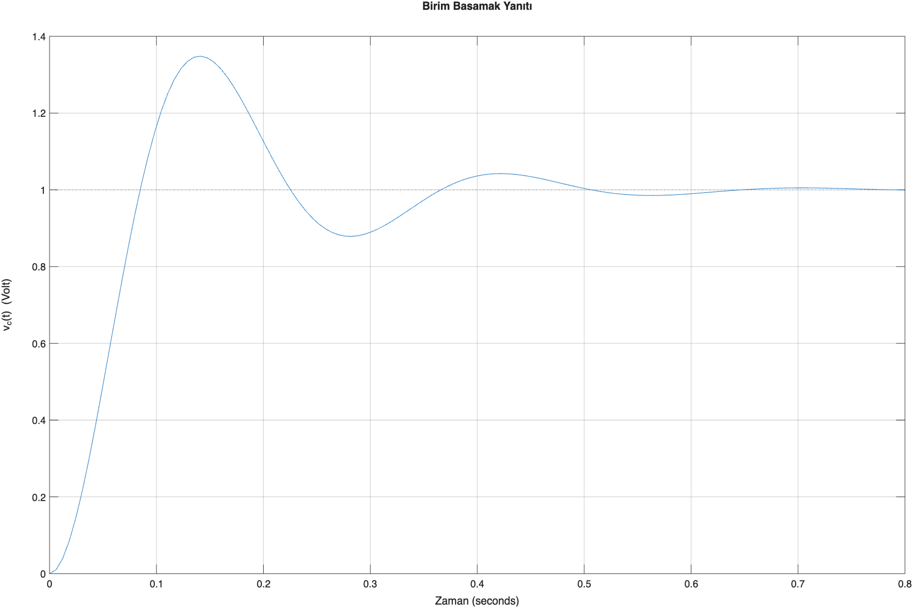
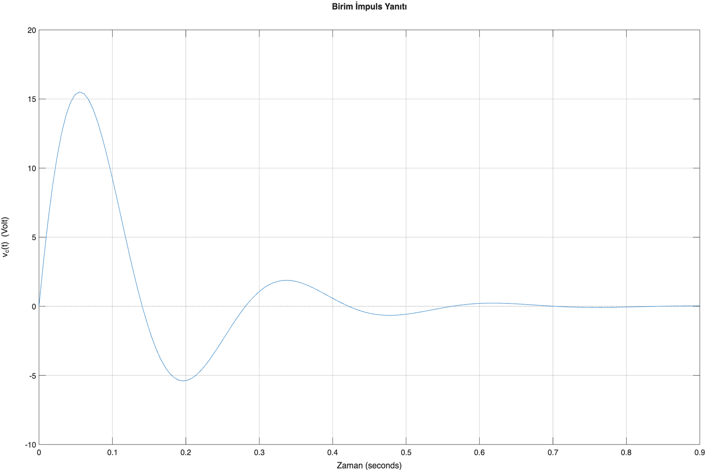
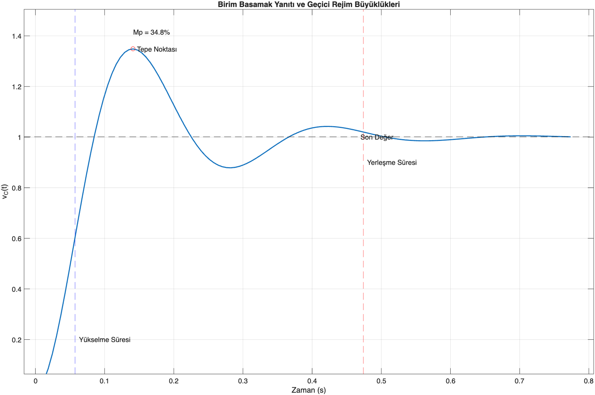
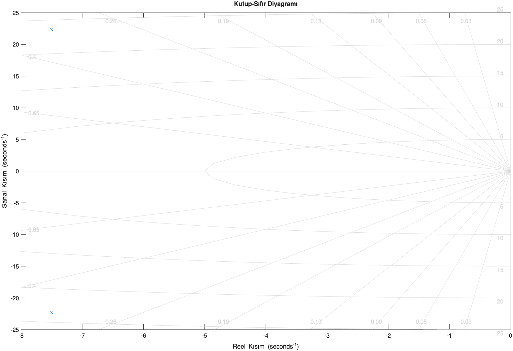

# RLC Control System Analysis and PID Design

## Project Overview

This project analyzes the dynamic behavior of a second-order RLC system using MATLAB and Simulink.

The system was modeled using both transfer function and state-space representations. Stability, controllability and observability were analyzed. A PID controller was designed and tuned to improve system performance.

---

## System Model

Transfer Function:

G(s) = 1 / (LC s² + RC s + 1)

Parameters:
- R = 18 Ω
- L = 1.2 H
- C = 1.5e-3 F

---

## Analysis Performed

- Pole-zero analysis
- Step and impulse response
- Theoretical vs MATLAB comparison
- State-space modeling
- Controllability & observability analysis
- PID controller design and tuning

---

## PID Performance Improvement

| Parameter | Before PID | After PID |
|-----------|------------|-----------|
| Rise Time | 0.0573 s | 0.0240 s |
| Overshoot | 34.83% | 8.10% |
| Settling Time | 0.4741 s | 0.2320 s |
| Steady-State Error | ≠ 0 | 0 |

---

## Tools Used

- MATLAB
- Simulink
- Control System Toolbox
---

## Sample Results

### Step Response

### Impulse Response

### Transient Characteristics

### Pole-Zero Map

